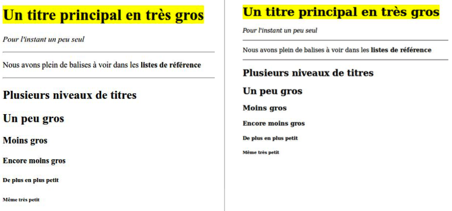

# Structure d'une page HTML

## Quelques balises utiles

En-tête de base d'un fichier HTML :

```html
<!DOCTYPE html>
<html lang="fr">
<head>
    <meta charset="UTF-8">
    <meta name="nom" content="valeur">
    <title>Titre de la page</title>
</head>
```

| Balises       | Description  |
|:------------- |:-------------|
| `<body></body>` | corps de la page |
| `<h1></h1>` | titre 1 |
| `<h2></h2>` | titre 2 |
| `<p></p>` | paragraphe |
| `<footer></footer>` | pied de page |
| `</html>` | ferme le fichier html |


## Navigateurs

En comparant la page sur plusieurs navigateurs, on peut observer qu’elles sont identiques du point de vue de la mise en page. Seule la police ou la taille du texte varie, ces dernières étant les propriétés par défaut du navigateur (étant donné que l’on n’a pas de fichier css, le navigateur prendra une police par défaut).



_À gauche le style par défaut du navigateur Chromium, à droite celui de Firefox_

## Erreurs à ne pas commettre

Voici quelques erreurs que l’on pourrait commettre lorsque l’on débute ou que l’on est pas assez concentré.

| Exemples d'erreurs | Description  |
|:------------- |:-------------|
| `<h1>Titre` | Ici l’élément n’est pas fermé, il faut impérativement fermer toutes les balises ! |
| `<h1>Titre</h2>` | L’élément `<h1>` est fermé avec un autre élément : `</h2>`. Un élément doit être fermé avec la balise fermante du même élément. |
| `<ul>Liste</ol>` | Comme précédemment, l’élément `<ul>` n’est pas fermé avec la bonne balise. |

## Éléments de base

### Le doctype

Tout document HTML doit commencer par le `<!DOCTYPE>` suivi de la balise `<html>`, et finit avec la balise fermante `</html>`.

La déclaration du _doctype_ se fait en début de fichier. Elle est indispensable. Elle indique au navigateur le langage informatique utilisé dans le fichier.

Les balises _html_ quant à elles enveloppent le contenu du fichier. On utilise souvent l’attribut `lang` avec cette balise afin de spécifier la langue qui sera utilisée dans le fichier.

```html
<!DOCTYPE html>
<html lang="fr">
...
</html>
```

### Les métadonnées (en-tête)

Vient ensuite l’en-tête, délimitée par les balises `<head>` et `</head>`, elle se situe toujours au-dessus du corps. Elle contient des éléments utiles du fichier mais qui ne seront pas affichés dans la page.

La balise de métadonnées  <meta>  permet comme son nom l’indique de définir des métadonnées (données connexes du fichier). Un des types de cette balise permet de définir le jeu de caractères utilisé (`<meta charset="jeu_de_carctères">`), un autre type permet de définir des métadonnées par un couple nom=contenu (`<meta name="nom" content="valeur">`)

La balise de titre `<title>` permet de donner un nom à la page. Ce nom sera affiché dans la barre de titre du navigateur ou de l'onglet, et est utilisé par les moteurs de recherche pour nommer la page.

```html
<head>
    <meta charset="UTF-8">
    <meta name="author" content="John Smith">
    <title>Titre de la page</title>
</head>
```

### Le corps 

L’en-tête est suivie des balises de sections du corps, contenues dans la partie _body_ (`<body>...</body>`), qui permettent de structurer la page de manière globale.

| `<header></header>` | Cette balise définit un bloc d'en-tête et contient habituellement un titre.  |
| `<footer></footer>` | Cette balise permet de définir un pied de page. |

Ensuite vient le moment de mettre du texte. On utilisera donc des balises de bloc du corps.

| `<h1>, <h2>, ..., <h6>` | Ces balises définissent un titre ou un sous-titre. Il en existe 6, allant de `<h1>` à `<h6>`. |
| `<p>` | Ce bloc est fait pour contenir uniquement du texte et éventuellement d'autres éléments (comme par exemple, `<em>`, `<strong>`, `<span>`, etc.). |
| `<hr/>` | Cette balise insère une ligne de séparation horizontale. |

Enfin, on pourra noter les balises de listes :

| `<ol>` | Cette balise permet de créer une liste ordonnée. Les éléments de cette liste seront précédés d'un numéro ou d'une lettre. |
| `<ul>` | Cette balise permet de créer une liste non-ordonnée. Les éléments de cette liste seront précédés d'une liste. |
| `<li>` | Les éléments de ces listes sont inclus entre des balises `<li>` et `</li>`. Ces listes peuvent être imbriquées les dans les autres pour créer plusieurs niveaux.


# Liens et navigation dans les pages

## Lien vers une nouvelle page

| Éléments / attributs | Description  |
|:------------- |:-------------|
| `<a href="lien"></a>` | Crée un lien vers _lien1_ |
| `target="_blank"` | Cet attribut à insérer dans une balise `<a>` permet lors du clic sur le lien de le renvoyer dans un nouvel onglet, une nouvelle page |

Pour diriger un lien vers une nouvelle page, il faudra donc utiliser l'attribut `target="_blank"` :

```html
<a href="https://fr.wikipedia.org/wiki/Chocolat" target="_blank">Wikipédia</a>
```

Ouvrir un lien dans une nouvelle page a l'avantage de garder la page en cours ouverte pour pouvoir retrouver rapidement celle-ci lors de la fermeture de l'onglet ou de la fenêtre du lien. L'inconvénient serait qu'on ne laisse pas le choix à l'utilisateur d'ouvrir ou non cette page dans un nouvel onglet, par exemple l'utilisateur pourrait vouloir naviguer jusqu'à une page précise sans que de nouveaux onglets ou de nouvelles pages s'ouvrent sans qu'il ne l'ait demandé.

## Autres types de liens

### E-mail

Pour rédiger un e-mail en cliquant sur le lien, on utilisera la valeur `mailto:adresse_mail` dans la balise `<a>` :

```html
<a href="mailto:nom@mail.com">Envoyer un mail</a>
```

### Fichier

Pour ouvrir un fichier pdf à partir d'un lien (toujours avec la balise `<a>`), il suffira de mettre le nom du fichier pdf (se trouvant tout de même dans le répertoire des fichiers HTML) :

```html
<a href="document.pdf">Télécharger le document</a>
```

## Ancres

Pour ajouter des ancres, on peut définir un **id** pour une section donnée et l'utiliser dans le lien correspondant.

_Définition d'un **id** pour le header (qui se situe en haut de la page) :_

```html
<header id="haut-de-page">
    <h1>Titre de la page</h1>
</header>
```

_Insertion de l'**id** dans le lien destiné à renvoyer en haut de la page :_

```html
<a href="#haut-de-page">Retour au haut de page</a>
```

Si l'on utilise une ancre pour le lien, un clic sur ce lien redirigera directement à cette ancre (par exemple si l'ancre est sur la balise header, on sera ramené à cette balise header (le haut de la page) lors du clic sur le lien correspondant). Tandis que si l'on met l'adresse de la page elle-même en tant que lien, cela aura pour effet de recharger la page. Dans le cas où il y aurait des images relativement lourdes par exemple, ces dernières se rechargeraient en même temps que la page, ralentissant donc le temps d'affichage de la page.
